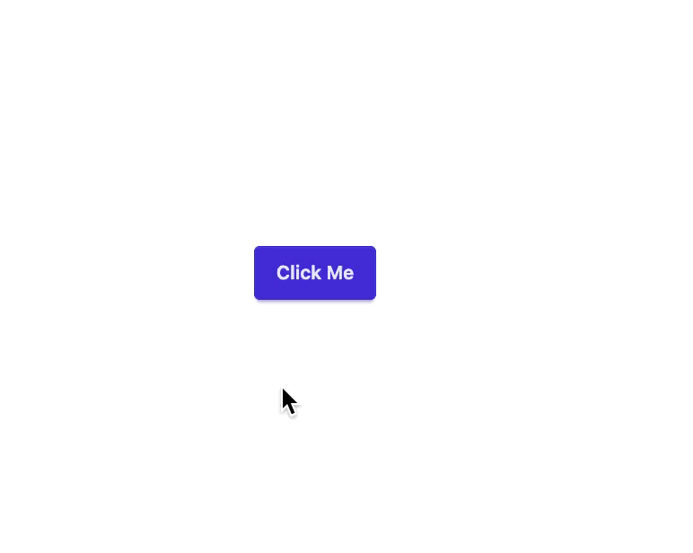
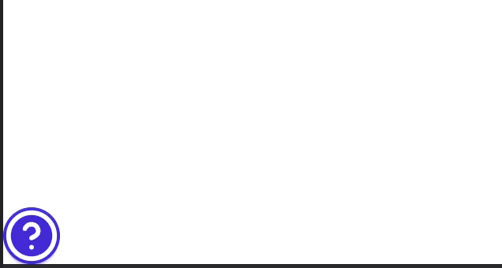
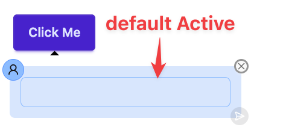
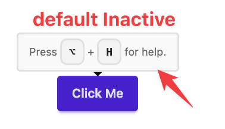
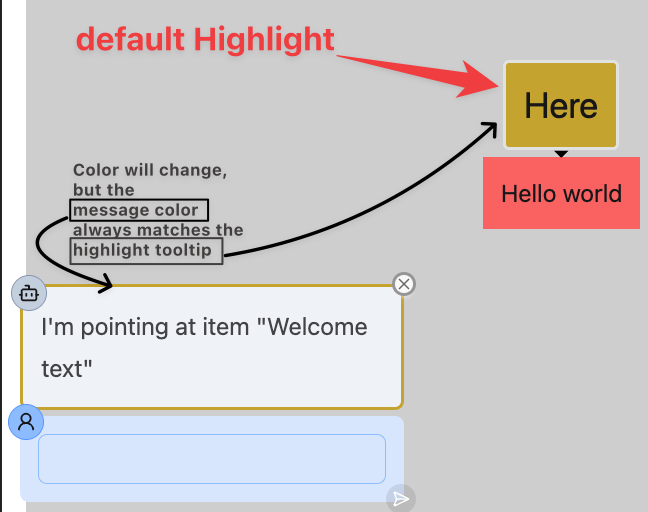

# Quickstart

## Prerequisites

The library defaults to using OpenAI for LLM calls. Information on how to add other LLM provider (e.g. Anthropic) [here](#custom-llm-model). Or open an issue in Github.

You need to add `OPENAI_API_KEY` as an environment variable pointing to your [OpenAI API Key](https://help.openai.com/en/articles/4936850-where-do-i-find-my-openai-api-key).

## Out of the Box - 3 Components Needed

1. `SmartToolTip`
2. `SmartToolTipProvider`
3. `SmartToolTipHelp`

Wrap your app in the `SmartToolTipProvider`:

```tsx dark
<SmartToolTipProvider>
  <App />
</SmartToolTipProvider>
```

And inside your app, wrap your components with the `SmartToolTip` component:

Add a `description` prop to the `SmartToolTip` component. This is internal-facing and will be sent to the LLM as context for the user's questions.

```tsx dark
<SmartToolTip description={"Click this button to open up a greeting."}>
  <Button onClick={() => alert("Hello")}>Click Me</Button>
</SmartToolTip>
```

Adding the `SmartToolTip` component will automatically add a chat tooltip to the component enabled on hover.

<div className="bg-neutral-800 p-1">


</div>
And if you'd like to enable to the user to ask about any of the annotated items on the screen, you can add `SmartToolTipHelp` anywhere on the screen. This is a help button.

```tsx dark

...

<AppContainer>
  <SmartToolTip description={"Click this button to open up a greeting."}>
    <Button onClick={() => alert("Hello")}>Click Me</Button>
  </SmartToolTip>

  <SmartToolTip description={"Click this button to open up a farewell."}>
    <Button onClick={() => alert("Goodbye")}>Click Me</Button>
  </SmartToolTip>

  <SmartToolTipHelp />
</AppContainer>;
```

<div className="bg-neutral-800 p-1">
  
</div>

<br />

# Customization

## Custom Tip Components

**Doesn't have to be tooltip.**

These are the default components that are used to render the tooltip.

- Active
- Inactive
- Highlight

<div className="flex flex-row items-center justify-around gap-3">
  <span className="bg-neutral-800 p-1">
    
  </span>
  <span className="bg-neutral-800 p-1">
    
  </span>
  <span className="bg-neutral-800 p-1">
    
  </span>
</div>

### Override the ToolTip Component

e.g...

- Maybe you'd prefer to use a modal instead of a tooltip for the chat window. Overwrite `Active`
- Maybe you'd prefer to add a border around the button to highlight it rather than pointing to it with a tooltip. Overwrite `Highlight`.

You can override any or all of these components by passing in your own components as long as they match the props of the default components.

```tsx dark

const CustomActive = (props: SmartToolTipActiveProps) =>{
   ...
}

const CustomInactive = (props: SmartToolTipInactiveProps) => {
    ...
}

const CustomHighlight = (props: SmartToolTipHighlightProps) => {
    ...
}

<SmartToolTip description={"Click this button to open up a greeting."} Active={CustomActive} Inactive={CustomInactive} Highlighted={CustomHighlight}>
  <Button onClick={() => alert("Hello")}>Click Me</Button>
</SmartToolTip>;
```

### Overwriting the ToolTip Content

Maybe you like the current tooltip/popover components, but want to implement your own content for the tooltip.

e.g.

- Maybe you'd like to style the Chat Window differently
- Maybe you'd like to display the activating hotkey differently
- Maybe you want the highlight components with a tooltip shaped like an arrow.

#### Overwriting the Active ToolTip Content

The default of this is the Chat Window.

```tsx dark
const CustomActiveContent = (props: ActiveToolTipContentProps) => {
    ...
}
const CustomActiveToolTip = (props: ActiveToolTipProps)=>{
    return <ActiveToolTip {...props} TipContent={<CustomActiveContent>}/>
}

...

<SmartToolTip description={"Click this button to open up a greeting."} Active={CustomActiveToolTip}>
  <Button onClick={() => alert("Hello")}>Click Me</Button>
</SmartToolTip>;
```

#### Overwriting the Active ToolTip Content

````tsx dark
const CustomInactiveContent = (props: InactiveToolTipContentProps) => {
    ...
}
const CustomInactiveToolTip = (props: InactiveToolTipProps)=>{
    return <InactiveToolTip {...props} TipContent={<CustomInactiveContent>}/>
}

```tsx dark
<SmartToolTip description={"Click this button to open up a greeting."} Inactive={CustomInactiveToolTip}>
  <Button onClick={() => alert("Hello")}>Click Me</Button>
</SmartToolTip>;
````

#### Overwriting the Highlight ToolTip Content

The default of this is the Chat Window.

````tsx dark

const CustomHighlightContent = (props: HighlightToolTipContentProps) => {
    ...
}
const CustomHighlightToolTip = (props: HighlightToolTipProps)=>{
    return <HighlightToolTip {...props} TipContent={<CustomHighlightContent>}/>
}

```tsx dark

<SmartToolTip description={"Click this button to open up a greeting."} Highlight={CustomHighlightToolTip}>
  <Button onClick={() => alert("Hello")}>Click Me</Button>
</SmartToolTip>;
````

## Custom LLM Model

The current default LLM used is OpenAI `gpt-4o-mini`.

To override this, you can change the model here

```tsx dark
<SmartToolTipProvider model="gpt-10">
  <App />
</SmartToolTipProvider>
```

or change the LLM to a different provider that implements type `AskLLM`

```ts dark
const askAnthropic: AskLLM = (params) => {
    ....
}
```

Add it globally:

```tsx dark
<SmartToolTipProvider askLLM={askAnthropic}>
  <App />
</SmartToolTipProvider>
```

Or change it locally

```tsx dark
<SmartToolTip askLLM={askAnthropic}>
  <Button {...props} />
</SmartToolTip>
```

## Custom Prompts

- Prompts need adjusting for your app?
- Need to adjust the prompts for your [custom model](#custom-llm-model)?
- Prompts not working as well expected?
  - Open up an issue on the Github page.
  - Try your hand at prompt engineering 💪

Overwrite any or all of the params defined in type `ModelParams`

You can use the `PROMPT_DEFAULTS` to access the defaults, if you'd like to extend them rather than override them.

Add it globally:

```tsx dark
<SmartToolTipProvider
  system={"Custom system prompt"}
  history={[{ role: "user", content: "Answer in Spanish" }]}
  rejectUserMessage={"I can't answer that."}
>
  <App />
</SmartToolTipProvider>
```

Or change it locally

```tsx dark
<SmartToolTip
  system={"Custom system prompt"}
  history={[{ role: "user", content: "Answer in Spanish" }]}
  rejectUserMessage={"I can't answer that."}
>
  <Button {...props} />
</SmartToolTip>
```

### Advanced - Custom Tool Descriptions

You can overwrite the tool descriptions and names as well.

#### Tools Used

The library currently uses 2 tools:

- `ToolLLM.GetActive`:
  - _Description_: Returns the active `SmartToolTip`.
- `ToolLLM.ListAvailable`:
  - _Description_: Returns all `SmartToolTip`s currently rendered on screen.

Both return info about the respective `SmartToolTip`s to provide context to the LLM model.

#### Overriding Tool Descriptions

Add it globally

```tsx dark
<SmartToolTipProvider
  toolDetails={{
    [ToolLLM.GetActive]: {
      description: "Custom description",
      name: "Custom name",
    },
    [ToolLLM.ListAvailable]: {
      description: "Custom description",
      name: "Custom name",
    },
  }}
>
  <App />
</SmartToolTipProvider>
```

Or change it locally

```tsx dark
<SmartToolTip
  toolDetails={{
    [ToolLLM.GetActive]: {
      description: "Custom description",
      name: "Custom name",
    },
    [ToolLLM.ListAvailable]: {
      description: "Custom description",
      name: "Custom name",
    },
  }}
>
  <Button {...props} />
</SmartToolTip>
```

You can use the `PROMPT_DEFAULTS` to access the defaults, if you'd like to extend them rather than override them.

```tsx dark
<SmartToolTip
  toolDetails={{
    ...PROMPT_DEFAULTS.toolDetails,
    [ToolLLM.ListAvailable]: {
      description: "Custom description",
      name: "Custom name",
    },
  }}
>
  <Button {...props} />
</SmartToolTip>
```
